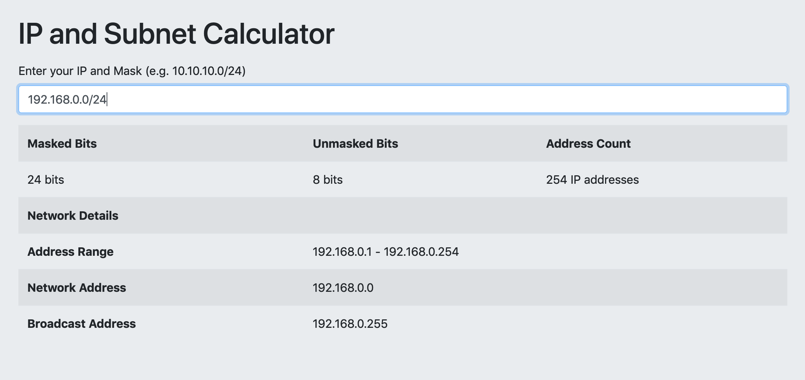

# Angular js Subnet Claculator

## About

This is a simple demonstration of webpack and how to make it work with angularjs

All of the examples I could find were old, so this one is Angularjs 1.7 and Webpack 4

It also contains a basic widget for calculating network ranges give an IP/Subnet
specification such as `192.168.1.0/24` for a `24 `bit mask of the network
`192.168.1.0`

## Demo

[https://mikeski.net/subnet-calc/](https://mikeski.net/subnet-calc/)

### Screenshot



## Quickstart

### NOTE

** Change `publicPath: '/'` if you are going to put this in a directory on your
website - see [https://mikeski.net/subnet-calc/](https://mikeski.net/subnet-calc/) **
 
```bash
  git clone https://github.com/mikebski/angularjs-webpack-subnet-calc.git
  npm install
  npm start
```

Then, point your browser at [http://localhost:8080](http://localhost:8080) and off you go.

## License

```
The MIT License (MIT)

Copyright (c) 2019 Mike Baranski

Permission is hereby granted, free of charge, to any person obtaining a copy
of this software and associated documentation files (the "Software"), to deal
in the Software without restriction, including without limitation the rights
to use, copy, modify, merge, publish, distribute, sublicense, and/or sell
copies of the Software, and to permit persons to whom the Software is
furnished to do so, subject to the following conditions:

The above copyright notice and this permission notice shall be included in
all copies or substantial portions of the Software.

THE SOFTWARE IS PROVIDED "AS IS", WITHOUT WARRANTY OF ANY KIND, EXPRESS OR
IMPLIED, INCLUDING BUT NOT LIMITED TO THE WARRANTIES OF MERCHANTABILITY,
FITNESS FOR A PARTICULAR PURPOSE AND NONINFRINGEMENT. IN NO EVENT SHALL THE
AUTHORS OR COPYRIGHT HOLDERS BE LIABLE FOR ANY CLAIM, DAMAGES OR OTHER
LIABILITY, WHETHER IN AN ACTION OF CONTRACT, TORT OR OTHERWISE, ARISING FROM,
OUT OF OR IN CONNECTION WITH THE SOFTWARE OR THE USE OR OTHER DEALINGS IN
THE SOFTWARE.

```
